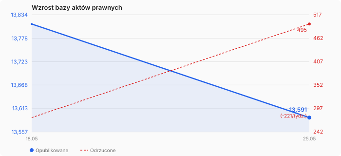

# nalegalu — polskie akty prawne i orzecznictwo

Polskie prawo w formacie Markdown — akty prawne z Dziennika Ustaw oraz powiązane orzecznictwo sądowe z bazy [SAOS](https://www.saos.org.pl/). Gotowe do użycia z narzędziami AI (Claude, ChatGPT, Obsidian, Cursor).

Więcej informacji: [nalegalu.org](https://nalegalu.org)

## Najczęściej cytowane akty prawne

Akty z największą liczbą powiązanych orzeczeń sądowych:

| Akt | Orzeczeń | Orzecznictwo |
|-----|---:|---|
| [Ustawa z dnia 17 listopada 1964 r. - Kodeks postępowania cywilnego.](prawo-cywilne/WDU19640430296/index.md) | 171 932 | [orzecznictwo.md](prawo-cywilne/WDU19640430296/orzecznictwo.md) |
| [Ustawa z dnia 23 kwietnia 1964 r. - Kodeks cywilny.](prawo-cywilne/WDU19640160093/index.md) | 114 790 | [orzecznictwo.md](prawo-cywilne/WDU19640160093/orzecznictwo.md) |
| [Ustawa z dnia 6 czerwca 1997 r. - Kodeks karny.](prawo-karne/WDU19970880553/index.md) | 43 300 | [orzecznictwo.md](prawo-karne/WDU19970880553/orzecznictwo.md) |
| [Ustawa z dnia 6 czerwca 1997 r. - Kodeks postępowania karnego.](prawo-karne/WDU19970890555/index.md) | 39 899 | [orzecznictwo.md](prawo-karne/WDU19970890555/orzecznictwo.md) |
| [Konstytucja Rzeczypospolitej Polskiej z dnia 2 kwietnia 1997 r.](prawo-konstytucyjne/WDU19970780483/index.md) | 33 445 | [orzecznictwo.md](prawo-konstytucyjne/WDU19970780483/orzecznictwo.md) |
| [Ustawa z dnia 17 grudnia 1998 r. o emeryturach i rentach z Funduszu Ub](inne/WDU19981621118/index.md) | 22 969 | [orzecznictwo.md](inne/WDU19981621118/orzecznictwo.md) |
| [Ustawa z dnia 26 czerwca 1974 r. Kodeks pracy.](prawo-pracy/WDU19740240141/index.md) | 21 714 | [orzecznictwo.md](prawo-pracy/WDU19740240141/orzecznictwo.md) |
| [Ustawa z dnia 13 października 1998 r. o systemie ubezpieczeń społeczny](inne/WDU19981370887/index.md) | 17 612 | [orzecznictwo.md](inne/WDU19981370887/orzecznictwo.md) |
| [Ustawa z dnia 28 lipca 2005 r. o kosztach sądowych w sprawach cywilnyc](inne/WDU20051671398/index.md) | 12 435 | [orzecznictwo.md](inne/WDU20051671398/orzecznictwo.md) |
| [Ustawa z dnia 14 czerwca 1960 r. Kodeks postępowania administracyjnego](prawo-administracyjne/WDU19600300168/index.md) | 9 155 | [orzecznictwo.md](prawo-administracyjne/WDU19600300168/orzecznictwo.md) |

## Orzecznictwo

Repozytorium zawiera kompaktowe indeksy orzecznictwa — łącznie **649 788** powiązań między orzeczeniami a aktami prawnymi.

Każdy akt prawny, na który powołują się orzeczenia, posiada plik `orzecznictwo.md` z listą cytujących orzeczeń pogrupowanych wg artykułu. Dla największych aktów (np. Kodeks cywilny) orzecznictwo jest podzielone na osobne pliki per artykuł.

Każde orzeczenie zawiera link do pełnego tekstu w serwisie [SAOS](https://www.saos.org.pl/).

## Jak korzystać

Najprostszy sposób: otwórz repozytorium w **Claude Cowork**, **Obsidian** lub **Cursor** — narzędzia te pozwalają AI przeszukiwać i analizować wszystkie pliki jednocześnie. Bez ręcznego kopiowania i wklejania.

**Przykład:** Wskaż folder nalegalu w Claude Cowork i zapytaj:

```
Jakie przesłanki odpowiedzialności deliktowej wynikają z art. 415 k.c.
w świetle najnowszego orzecznictwa SN? Podaj sygnatury z bazy.
```

Claude sam otworzy Kodeks cywilny, znajdzie art. 415, sprawdzi orzecznictwo i przygotuje analizę z konkretnymi sygnaturami.

## Aktualizacja danych

Dane aktualizują się automatycznie. Najnowszą wersję można pobrać jako [ZIP z zakładki Releases](https://github.com/nalegaluorg/nalegalu-public/releases).

## Dokumentacja

| Przewodnik | Opis |
|------------|------|
| [Jak korzystać z nalegalu](docs/jak-korzystac-z-nalegalu.md) | Kompletny przewodnik — od przeglądania na GitHubie do pracy z AI |
| [Konfiguracja Claude Cowork](docs/konfiguracja-claude-cowork.md) | Krok po kroku: instalacja, ustawienie projektu, instrukcje dla AI |
| [Biblioteka promptów](docs/prompty.md) | Gotowe prompty do analizy przepisów, orzecznictwa, pism procesowych |
| [Przewodnik pracy LLM](docs/przewodnik-llm.md) | Architektura bazy, system scoringu, strategie wyszukiwania |

## Dziedziny prawa

| Dziedzina | Aktów | Opis |
|-----------|------:|------|
| [Ochrona danych osobowych](prawo-ochrony-danych/README.md) | 8 | [Pełna lista aktów →](prawo-ochrony-danych/README.md) (2 z orzecznictwem) |
| [Prawo administracyjne](prawo-administracyjne/README.md) | 46 | [Pełna lista aktów →](prawo-administracyjne/README.md) (13 z orzecznictwem) |
| [Prawo bankowe](prawo-bankowe/README.md) | 24 | [Pełna lista aktów →](prawo-bankowe/README.md) (7 z orzecznictwem) |
| [Prawo budowlane](prawo-budowlane/README.md) | 31 | [Pełna lista aktów →](prawo-budowlane/README.md) (6 z orzecznictwem) |
| [Prawo cywilne](prawo-cywilne/README.md) | 104 | [Pełna lista aktów →](prawo-cywilne/README.md) (45 z orzecznictwem) |
| [Prawo energetyczne](prawo-energetyczne/README.md) | 23 | [Pełna lista aktów →](prawo-energetyczne/README.md) (5 z orzecznictwem) |
| [Prawo handlowe](prawo-handlowe/README.md) | 21 | [Pełna lista aktów →](prawo-handlowe/README.md) (7 z orzecznictwem) |
| [Prawo karne](prawo-karne/README.md) | 116 | [Pełna lista aktów →](prawo-karne/README.md) (40 z orzecznictwem) |
| [Prawo konstytucyjne](prawo-konstytucyjne/README.md) | 2 | [Pełna lista aktów →](prawo-konstytucyjne/README.md) (1 z orzecznictwem) |
| [Prawo morskie](prawo-morskie/README.md) | 6 | [Pełna lista aktów →](prawo-morskie/README.md) (2 z orzecznictwem) |
| [Prawo ochrony środowiska](prawo-ochrony-srodowiska/README.md) | 50 | [Pełna lista aktów →](prawo-ochrony-srodowiska/README.md) (9 z orzecznictwem) |
| [Prawo podatkowe](prawo-podatkowe/README.md) | 175 | [Pełna lista aktów →](prawo-podatkowe/README.md) (29 z orzecznictwem) |
| [Prawo pracy](prawo-pracy/README.md) | 51 | [Pełna lista aktów →](prawo-pracy/README.md) (20 z orzecznictwem) |
| [Prawo telekomunikacyjne](prawo-telekomunikacyjne/README.md) | 6 | [Pełna lista aktów →](prawo-telekomunikacyjne/README.md) (2 z orzecznictwem) |
| [Prawo upadłościowe](prawo-upadlosciowe/README.md) | 14 | [Pełna lista aktów →](prawo-upadlosciowe/README.md) (4 z orzecznictwem) |
| [Prawo zamówień publicznych](prawo-zamowien/README.md) | 19 | [Pełna lista aktów →](prawo-zamowien/README.md) (7 z orzecznictwem) |
| [Inne](inne/README.md) | 13116 | [Pełna lista aktów →](inne/README.md) (1044 z orzecznictwem) |

<!-- STATS:START -->
## Statystyki



| | Wartość |
|---|---:|
| Opublikowane akty | **13,812** |
| Odrzucone (jakość) | 275 |
| Artykuły | 193,078 |
| Znaki treści | 469.2M |
| Śr. znaków/akt | 33,972 |
| Śr. artykułów/akt | 14.0 |

**Źródła danych:**

- ISAP PDF: 13,346 (97%)
- ELI HTML: 420 (3%)
- unknown: 46 (0%)

*Odrzucone: 0 skanów bez OCR, 176 zablokowanych przez bramkę jakości, 275 inne*

*Od 2026-05-18: +491 aktów*

*Ostatnia aktualizacja: 2026-05-24*
<!-- STATS:END -->

## Zakres i ograniczenia

Repozytorium zawiera obowiązujące akty prawne z Dziennika Ustaw (teksty jednolite) oraz indeksy orzecznictwa sądowego z bazy SAOS. To nie jest oficjalne źródło prawa — jedynym autentycznym źródłem jest Dziennik Ustaw publikowany na isap.sejm.gov.pl.

## Licencja

Treść aktów prawnych jest wyłączona spod ochrony prawa autorskiego na mocy art. 4 ustawy o prawie autorskim i prawach pokrewnych. Struktura i metadane: [CC0 1.0 — Public Domain](LICENSE).

*13812 aktów • wygenerowano automatycznie przez [nalegalu](https://github.com/nalegaluorg/nalegalu) • źródło danych: [ISAP](https://isap.sejm.gov.pl) + [SAOS](https://www.saos.org.pl) • aktualizacja: 2026-05-24*
